# AtomicProof Compiler 系统完整用例图

本文档给出当前仓库中 `AtomicProof Compiler / utxo_interpreter` 工具链的完整用例图。系统边界以内包括编译器、AST 解释器、字节码运行器、CLI 调试器、交互式 Shell、自测、构建与发布脚本；系统边界以外包括下游部署工具和链节点。

## 参与者

| 参与者 | 说明 |
|---|---|
| 合约开发者 | 编写 `.ct` 合约，编译合约，查看编译产物，并用 AST/字节码方式快速验证函数行为。 |
| 库维护者 | 编写 `Library` 模板和标准库文件，供合约通过 `import` 复用。 |
| 测试/验证人员 | 做合约冒烟测试、AST 解释测试、字节码运行测试和内置自测。 |
| 调试人员 | 使用 CLI 调试器设置断点、单步执行、查看源码/字节码/栈/调用栈和交易上下文。 |
| REPL 用户 | 使用交互式 Shell 试验表达式、函数、结构体，加载合约文件，或从 Shell 切入调试器。 |
| 构建/发布维护者 | 配置 CMake、选择依赖来源、构建 Docker 镜像、交叉编译并打包发布。 |
| CI/自动化脚本 | 自动构建、运行自测/冒烟测试、打包和触发监控通知。 |
| apc-buildunlockscript 下游部署工具 | 消费编译 JSON 中的 `lock.hex`、`abi`、`unlock`、`structs` 等信息来构造部署/调用交易。 |
| TBC/Bitcoin 节点 | 接收下游工具构造并广播的真实交易，不直接属于本仓库系统边界。 |

## PlantUML 图

源码文件位于 [atomicproof_use_case_diagram.puml](atomicproof_use_case_diagram.puml)。可用 PlantUML 插件或命令行渲染为图片：

```bash
plantuml project_doc/atomicproof_use_case_diagram.puml
```

```plantuml
@startuml
title AtomicProof Compiler 系统完整用例图

left to right direction
skinparam packageStyle rectangle
skinparam shadowing false
skinparam actorStyle awesome
skinparam usecase {
  BackgroundColor #F8FAFC
  BorderColor #334155
}
skinparam ArrowColor #475569
skinparam rectangle {
  BorderColor #1F2937
}

actor "合约开发者" as Developer
actor "库维护者" as LibraryMaintainer
actor "测试/验证人员" as Tester
actor "调试人员" as DebugUser
actor "REPL 用户" as ReplUser
actor "构建/发布维护者" as Maintainer
actor "CI/自动化脚本" as CI
actor "apc-buildunlockscript\n下游部署工具" as DeployTool
actor "TBC/Bitcoin 节点" as Chain

rectangle "AtomicProof Compiler / utxo_interpreter 工具链" as System {
  package "通用入口" {
    usecase "查看帮助" as UC_Help
    usecase "查看版本与构建能力" as UC_Version
    usecase "设置日志级别" as UC_Log
    usecase "读取用户配置" as UC_Config
    usecase "启用子作用域副栈模式\n--asa" as UC_ASA
  }

  package "合约编译与产物导出" {
    usecase "编译 .ct 合约" as UC_Compile
    usecase "解析 import 并合并 Library" as UC_Import
    usecase "词法分析" as UC_Lexer
    usecase "语法分析并构建 AST" as UC_Parser
    usecase "语义/类型/所有权检查" as UC_Semantic
    usecase "生成 BVM 字节码" as UC_Bytecode
    usecase "导出编译 JSON\nlock/abi/unlock/structs" as UC_ExportJson
    usecase "生成调试信息\n源码行号/PC/函数映射" as UC_DebugInfo
    usecase "报告错误与警告" as UC_Error
    usecase "复用标准库或自定义库" as UC_UseLibrary
  }

  package "非交互式运行与测试" {
    usecase "运行 AST 解释器" as UC_RunAST
    usecase "运行字节码/BVM 模拟器" as UC_RunBytecode
    usecase "选择入口函数" as UC_SelectFunction
    usecase "传入位置参数" as UC_PositionArgs
    usecase "设置命名参数/结构体字段" as UC_Param
    usecase "设置 self 实例字段" as UC_Self
    usecase "设置 BVM 运行时字段" as UC_BVM
    usecase "加载交易上下文文件\ntext/json txfile" as UC_TxFile
    usecase "顺序执行多个函数" as UC_MultiFunction
    usecase "查看运行结果与栈状态" as UC_RunResult
    usecase "运行内置自测\nruntime/ast" as UC_SelfTest
    usecase "批量合约冒烟测试" as UC_SmokeTest
  }

  package "交互式调试" {
    usecase "启动 CLI 调试器" as UC_Debug
    usecase "选择调试函数并输入参数" as UC_DebugTarget
    usecase "控制执行\nrun/reset/continue/pause" as UC_DebugControl
    usecase "单步调试\nstep/next/finish" as UC_Step
    usecase "管理断点\nbreak/delete/enable/disable" as UC_Breakpoint
    usecase "查看源码/字节码" as UC_ViewSourceBytecode
    usecase "查看主栈/副栈" as UC_ViewStack
    usecase "查看调用栈" as UC_Backtrace
    usecase "加载/查看调试交易数据" as UC_DebugTx
    usecase "退出调试器" as UC_QuitDebug
  }

  package "交互式 Shell / REPL" {
    usecase "启动交互式 Shell" as UC_Shell
    usecase "预加载合约文件" as UC_Preload
    usecase "输入表达式/语句/块定义" as UC_InputCell
    usecase "定义函数和结构体" as UC_Define
    usecase "调用函数并查看结果" as UC_CallFunction
    usecase "加载合约文件\n%run/%load" as UC_LoadInShell
    usecase "查看命名空间\n%who" as UC_Who
    usecase "查看历史/清屏/重置" as UC_ShellManage
    usecase "从 Shell 进入调试器\n%debug" as UC_ShellDebug
  }

  package "构建、发布与环境" {
    usecase "配置 CMake 构建" as UC_CMake
    usecase "选择 JSON 依赖来源\n系统/本地/FetchContent/镜像" as UC_JsonDep
    usecase "启用或关闭调试器组件\nBUILD_DEBUGGER" as UC_BuildDebugger
    usecase "交叉编译 Windows 目标" as UC_CrossBuild
    usecase "构建 Docker 镜像" as UC_Docker
    usecase "打包发布\n.tar.gz/.zip/.deb" as UC_Package
    usecase "执行每日监控/通知工作流" as UC_Monitor
  }

  package "部署调用集成产物" {
    usecase "提供 lock.hex 给部署交易" as UC_LockHex
    usecase "提供 abi/unlock 给解锁脚本构造" as UC_ABIUnlock
    usecase "提供 structs 给交易数据序列化" as UC_Structs
    usecase "提供 constructor/self 占位符信息" as UC_ConstructorData
  }
}

Developer --> UC_Compile
Developer --> UC_RunAST
Developer --> UC_RunBytecode
Developer --> UC_Help
Developer --> UC_Version
Developer --> UC_Log
Developer --> UC_ASA

LibraryMaintainer --> UC_UseLibrary
LibraryMaintainer --> UC_Compile

Tester --> UC_RunAST
Tester --> UC_RunBytecode
Tester --> UC_SelfTest
Tester --> UC_SmokeTest

DebugUser --> UC_Debug
DebugUser --> UC_DebugInfo

ReplUser --> UC_Shell
ReplUser --> UC_ShellDebug

Maintainer --> UC_CMake
Maintainer --> UC_Package
Maintainer --> UC_Docker
Maintainer --> UC_CrossBuild

CI --> UC_CMake
CI --> UC_SelfTest
CI --> UC_SmokeTest
CI --> UC_Package
CI --> UC_Monitor

DeployTool --> UC_LockHex
DeployTool --> UC_ABIUnlock
DeployTool --> UC_Structs
DeployTool --> UC_ConstructorData
DeployTool --> Chain : 构造/广播交易

UC_Compile .> UC_Config : <<include>>
UC_Compile .> UC_Import : <<include>>
UC_Compile .> UC_Lexer : <<include>>
UC_Compile .> UC_Parser : <<include>>
UC_Compile .> UC_Semantic : <<include>>
UC_Compile .> UC_Bytecode : <<include>>
UC_Compile .> UC_ExportJson : <<include>>
UC_Compile .> UC_Error : <<extend>>
UC_Compile .> UC_DebugInfo : <<extend>>
UC_UseLibrary .> UC_Import : <<include>>

UC_RunAST .> UC_Import : <<include>>
UC_RunAST .> UC_Parser : <<include>>
UC_RunAST .> UC_SelectFunction : <<include>>
UC_RunAST .> UC_PositionArgs : <<extend>>
UC_RunAST .> UC_Param : <<extend>>
UC_RunAST .> UC_Self : <<extend>>
UC_RunAST .> UC_BVM : <<extend>>
UC_RunAST .> UC_TxFile : <<extend>>
UC_RunAST .> UC_MultiFunction : <<extend>>
UC_RunAST .> UC_RunResult : <<include>>
UC_RunAST .> UC_Error : <<extend>>

UC_RunBytecode .> UC_Compile : <<include>>
UC_RunBytecode .> UC_SelectFunction : <<include>>
UC_RunBytecode .> UC_PositionArgs : <<extend>>
UC_RunBytecode .> UC_TxFile : <<extend>>
UC_RunBytecode .> UC_RunResult : <<include>>
UC_RunBytecode .> UC_Error : <<extend>>

UC_SmokeTest .> UC_Compile : <<include>>
UC_SmokeTest .> UC_DebugInfo : <<extend>>
UC_SelfTest .> UC_Error : <<extend>>

UC_Debug .> UC_Compile : <<include>>
UC_Debug .> UC_DebugInfo : <<include>>
UC_Debug .> UC_DebugTarget : <<include>>
UC_Debug .> UC_DebugControl : <<include>>
UC_Debug .> UC_Step : <<extend>>
UC_Debug .> UC_Breakpoint : <<extend>>
UC_Debug .> UC_ViewSourceBytecode : <<extend>>
UC_Debug .> UC_ViewStack : <<extend>>
UC_Debug .> UC_Backtrace : <<extend>>
UC_Debug .> UC_DebugTx : <<extend>>
UC_Debug .> UC_QuitDebug : <<include>>

UC_Shell .> UC_Preload : <<extend>>
UC_Shell .> UC_InputCell : <<include>>
UC_Shell .> UC_Define : <<extend>>
UC_Shell .> UC_CallFunction : <<extend>>
UC_Shell .> UC_LoadInShell : <<extend>>
UC_Shell .> UC_Who : <<extend>>
UC_Shell .> UC_ShellManage : <<extend>>
UC_ShellDebug .> UC_Debug : <<include>>

UC_CMake .> UC_JsonDep : <<extend>>
UC_CMake .> UC_BuildDebugger : <<extend>>
UC_CMake .> UC_CrossBuild : <<extend>>
UC_Docker .> UC_CMake : <<include>>
UC_Package .> UC_CMake : <<include>>

UC_ExportJson .> UC_LockHex : <<include>>
UC_ExportJson .> UC_ABIUnlock : <<include>>
UC_ExportJson .> UC_Structs : <<include>>
UC_ExportJson .> UC_ConstructorData : <<include>>

note right of UC_RunBytecode
  依赖调试器/BVM 模拟器组件；
  构建时需要 BUILD_DEBUGGER=ON。
end note

note right of DeployTool
  下游部署工具不属于本仓库主体。
  它读取编译 JSON 后构造、
  签名并广播真实交易。
end note
@enduml
```



## 关系摘要

| 主用例 | 必含关系 |
|---|---|
| 编译 `.ct` 合约 | 读取配置、解析 import、词法分析、语法分析、语义/类型/所有权检查、生成 BVM 字节码、导出 JSON。 |
| 运行 AST 解释器 | 解析/合并库、构建 AST、选择入口函数、输出解释结果；可扩展注入位置参数、命名参数、`self`、`BVM` 和 `txfile`。 |
| 运行字节码/BVM 模拟器 | 先编译合约，再选择入口函数、压入参数、加载交易上下文并显示栈/执行结果。 |
| 启动 CLI 调试器 | 先编译并生成调试信息，再选择调试目标，执行断点、单步、查看源码/字节码/栈/调用栈和交易上下文等操作。 |
| 启动交互式 Shell | 读取用户输入单元并执行；可扩展为预加载文件、加载合约、定义函数/结构体、查看命名空间、管理历史和进入调试器。 |
| 打包发布 | 依赖 CMake 构建结果，可生成 `.tar.gz`、`.zip`、`.deb` 等发布产物。 |
