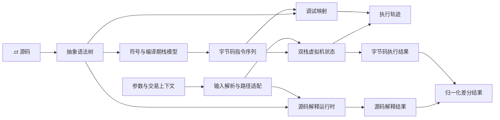

# 开题报告“数据结构设计”补充建议

## 一、建议结论

建议在开题报告“3.2 功能模块设计”之后、“4. 系统可行性分析”之前，增加“3.3 数据结构设计”。

本课题是编译器、解释器和调试器组成的工具型软件，核心数据主要存在于内存并以 JSON/JSONL 文件或消息交换，不宜套用传统信息系统的数据库 E-R 图或数据表设计。该章应回答以下问题：

1. 系统需要表示哪些核心对象；
2. 各对象之间是什么所有权、引用或映射关系；
3. 数据在编译、源码解释、字节码执行和调试过程中如何变化；
4. 高级语言类型如何转换为双栈虚拟机的字节序列；
5. 两条执行路径如何共享输入并形成可比较的输出。

## 二、建议纳入的核心内容

| 内容 | 需要说明的重点 | 与开题报告的关系 |
| --- | --- | --- |
| 数据结构设计目标 | 分层、强类型、可追踪、可序列化和可扩展 | 对应可靠性、可扩展性和可维护性需求 |
| 语法与编译期结构 | AST、函数、结构体、源码位置、符号与编译期栈布局 | 对应统一前端和编译路径 |
| 源码解释运行时结构 | 运行时值、变量槽、作用域链、函数帧和所有权状态 | 对应 AST 源码解释路径 |
| 字节码执行结构 | 指令序列、PC、主栈、副栈、调用栈和虚拟机状态 | 对应双栈字节码执行路径 |
| 交易上下文结构 | 函数参数、合约实例字段、BVM 字段及两路径适配方式 | 对应上下文注入 |
| 调试映射与执行轨迹 | 源码位置、PC 映射、作用域、变量、每步栈快照和元素生命周期 | 对应调试映射与可视化观察 |
| 结果与差分比较结构 | 执行状态、返回值、栈顶值、错误、位置和统计数据的归一化 | 对应差分验证 |
| 数据约束和不变式 | 类型一致性、作用域可见性、栈顺序、状态迁移、位置范围和文件版本 | 将数据设计转化为可测试条件 |

## 三、可直接纳入开题报告的正文

### 3.3 数据结构设计

本系统的数据结构围绕“源码语义可表示、双栈执行可复现、交易上下文可注入、调试状态可追踪、两路径结果可比较”五个目标设计。根据数据所处的生命周期，系统将核心数据分为语法与编译期数据、源码解释运行时数据、字节码执行数据、交易上下文数据、调试轨迹数据和输出结果数据六类。各类结构保持职责单一，通过明确的转换边界连接，避免将源码级对象直接等同于虚拟机栈元素。

#### 3.3.1 数据结构总体关系

系统以抽象语法树作为统一前端输出。编译路径从抽象语法树提取符号和类型信息，建立编译期栈布局并生成指令序列；源码解释路径直接遍历抽象语法树，在作用域环境和函数帧中管理运行时值。结构化交易上下文经解析后，分别适配为源码解释所需的参数、合约实例和 BVM 对象字段，以及字节码执行所需的交易验证字段。调试模块使用源码位置与字节码位置的映射解释虚拟机状态，并把每一步执行前后的主副栈快照序列化为轨迹文件。两条执行路径最终通过归一化结果进行差分比较。

图10 解释性执行系统核心数据结构关系图

#### 3.3.2 语法与编译期数据结构

抽象语法树采用分层节点模型。基础节点保存行列位置，并可保存原始源文件位置和可选的父节点引用；合约节点拥有函数、构造函数和结构体定义；函数节点保存函数名、形式参数、返回类型和语句块；结构体节点保存字段名、字段类型、数组长度和字节宽度。树形独占所有关系用于明确节点生命周期，可选父节点使用非所有引用，避免循环所有权。有效源码位置为静态错误和调试映射提供依据。

编译期符号结构记录符号名、声明类型、初始化状态、数组元素信息和复合类型字段信息。由于目标虚拟机没有命名变量和通用内存，符号表还需同步建模主栈、副栈和固定值区。每个高级语言变量通过符号标签与栈中位置关联，数组元素使用“数组名+下标”形成唯一标识，复合类型保存字段展开信息。作用域进入时保存当前符号表，退出时恢复上层状态并生成必要的栈整理指令。

静态所有权信息与符号栈布局分开管理。该结构记录变量的数据来源、声明与最近使用位置、已声明、已使用或已消费状态，并通过元素位图和字段路径映射精细追踪数组元素与复合字段的所有权。当条件分支结束时，系统需要合并分支所有权状态，防止已消费的栈数据在后续路径中被重复使用。

#### 3.3.3 源码解释运行时数据结构

源码解释路径以运行时值、变量槽、作用域环境和函数帧为核心。运行时值是一个带类型标签的联合结构，可表示空值、整数、布尔值、字节序列、字符串、地址、数组、结构体和内置对象。其中，数组用有序运行时值容器表示，结构体用“字段名—字段值”映射表示，内置对象额外保存对象名。运行时值同时保留源语言声明类型，以区分底层存储形式相同但语义不同的类型。

变量槽在运行时值之上增加声明类型、所有权状态、存储区域和退出作用域时的保留标记。所有权状态包括可用、已消费和已删除；存储区域包括主栈、副栈、固定值区、合约实例成员和内置对象。作用域环境以名称到变量槽的映射表保存局部变量，并保留父环境引用；变量查找从当前环境向外层逐级进行，赋值只修改最近可见定义。函数帧保存函数名、当前作用域和调用位置，多个函数帧按调用顺序组成调用栈。

#### 3.3.4 字节码与双栈虚拟机数据结构

系统明确区分编译期逻辑栈元素和虚拟机运行期栈元素。编译期元素同时保存变量名、类型和数据标记，用于计算变量位置、生成栈操作和实现标签重命名；运行期元素只保存真实脚本字节。两者通过字节码生成过程建立语义对应，但不是同一物理数据结构，编译期标签也不会成为链上脚本数据。

编译路径将指令按执行顺序保存为有序序列，每条指令由操作码和可选操作数组成，指令在序列中的下标即字节码位置 PC。虚拟机栈元素只保存字节序列，整数按 ScriptNum 规则编解码，布尔判定也以脚本字节语义为准，从而避免将源码解释器的高级类型规则误用于底层脚本执行。

主栈和副栈均使用有序栈容器表示，容器末尾为栈顶，支持压栈、弹栈、复制、交换、按深度选取和滚动等操作。虚拟机执行状态由当前 PC、主栈、副栈、调用栈、函数执行范围、交易上下文、断点集合、错误信息和运行状态共同组成。运行状态包括就绪、运行、暂停、单步、完成和错误。字节码函数帧保存函数名、返回 PC、调用位置、栈基址、入口 PC 和已执行指令数，用于恢复函数调用前后的执行环境。

#### 3.3.5 交易上下文数据结构

交易上下文采用“外部逻辑模型+路径适配结构”的设计。外部 JSON 输入按用途分为函数参数、合约实例字段和 BVM 字段三组，并允许通过层级路径表示结构体字段和数组元素。输入解析器负责字段名归一化、类型转换、默认值补齐、字节序列编码和错误检查。

对源码解释路径，函数参数转换为有序运行时值列表，合约实例字段和 BVM 字段转换为运行时结构体或内置对象。对字节码执行路径，目前核心交易验证字段包括交易版本、锁定时间、输入数量、输出数量、输入哈希、解锁输入和输出哈希。版本、锁定时间和输入输出数量使用无符号 32 位整数，哈希和脚本数据使用字节序列。两条路径共享同一逻辑输入，但使用不同的内部表示，这种设计既避免了重复构造测试数据，又保留了高级语言语义与底层脚本语义的边界。

#### 3.3.6 调试映射与执行轨迹数据结构

调试信息以 PC 和源码位置为主索引。前端位置记录源文件、行列和标记长度，字节码生成时将其转换为包含文件名、起始行列和结束行列的调试位置；两者属于同一逻辑位置模型，但会根据阶段使用不同的内部表示。指令调试信息包含 PC、操作码、操作数、源码位置和受影响变量；函数调试信息包含函数范围、形式参数、局部变量和作用域；作用域信息以树形结构记录父子作用域。系统同时建立“PC 到源码位置”和“源码行到 PC 列表”两类索引，前者用于单步执行和当前位置展示，后者用于解析源码断点。

执行轨迹按时间顺序保存轨迹步列表。每个轨迹步记录步号、PC、指令、操作码、操作数、源码位置、函数名、执行前后的主栈和副栈快照及错误信息。在序列化阶段，系统根据前后快照计算压入、弹出、重排和主副栈迁移，并为栈元素生成生命周期记录。轨迹文件保存格式名、格式版本和栈顺序说明，用于可视化插件的格式校验和向后兼容。

实时调试服务在上述状态快照之上使用 JSONL 消息。请求消息包含序号、命令和参数；响应消息包含请求序号、命令、成功标记、数据体和可选错误信息；事件消息包含事件名和状态快照。该结构使解释执行内核与可视化插件通过稳定消息契约解耦。

#### 3.3.7 输出结果与差分比较结构

源码解释结果主要包含执行是否成功、入口函数、返回值列表和错误信息。字节码执行结果主要包含编译与执行状态、入口函数、函数 PC 范围、当前 PC、指令统计、最大栈深度、最大调用深度、主副栈结果、警告和错误信息。编译产物则以结构化 JSON 保存元数据、结构体、合约接口、锁定脚本、解锁模板、构造参数和函数信息。

为实现差分测试，系统应在上述两类路径结果之上建立可比较结果模型，统一表示执行状态、规范化返回数据、规范化错误类别、源码位置、字节码位置和关键统计信息。源码运行时值应先按 ScriptNum、布尔值和字节序列的目标规则编码，再与字节码路径的主栈栈顶或约定返回区域比较；错误则按类别和位置比较，不仅比较可能变化的错误文本。

#### 3.3.8 核心数据字典

| 逻辑结构 | 主要字段 | 容器或关系 | 主要用途 |
| --- | --- | --- | --- |
| 语法节点 | 节点类型、源码位置、父节点 | 父子树 | 统一前端、静态分析和源码解释 |
| 函数与结构体定义 | 名称、参数、返回类型、语句块或字段列表 | 合约节点拥有 | 描述程序骨架和复合类型 |
| 编译期符号 | 名称、类型、初始化状态、数组或复合信息 | 符号表与编译期栈关联 | 类型检查、栈位置追踪和字节码生成 |
| 静态所有权信息 | 数据来源、变量状态、元素位图、字段状态和位置 | 变量映射+分支状态 | 检查重复消费和分支后所有权安全 |
| 运行时值 | 运行时类型、声明类型、实际值 | 带标签联合 | 统一表示源语言基本值和复合值 |
| 变量槽 | 运行时值、声明类型、所有权、存储区域、保留标记 | 被作用域环境按名称管理 | 管理变量生命周期和可用性 |
| 作用域环境 | 环境名、局部槽、父环境 | 父链+名称映射 | 实现词法作用域和变量解析 |
| 源码函数帧 | 函数名、环境、调用位置 | 有序调用栈 | 恢复源码级函数调用上下文 |
| 虚拟机栈元素 | 原始字节 | 主栈或副栈元素 | 表示底层脚本数据 |
| 虚拟机状态 | PC、主副栈、调用栈、运行状态、交易上下文和错误 | 可变执行状态聚合 | 复现双栈字节码执行 |
| 字节码函数帧 | 函数名、返回 PC、调用位置、栈基址、入口 PC | 虚拟机调用栈元素 | 管理字节码函数调用 |
| 交易上下文 | 版本、锁定时间、输入输出数、哈希和解锁数据 | 输入逻辑模型与两类路径适配结构 | 构造本地 UTXO 验证条件 |
| 调试信息 | PC 映射、函数、作用域、变量和指令 | 有序索引+作用域树 | 断点解析、位置回溯和变量展示 |
| 轨迹步 | 步号、PC、指令、源码位置、函数、前后栈和错误 | 按执行顺序组成列表 | 离线回放、可视化和错误定位 |
| 实时调试消息 | 类型、序号、命令或事件、数据体和状态快照 | JSONL 请求—响应—事件 | 插件实时断点、单步和状态查看 |
| 路径执行结果 | 状态、函数、返回或栈数据、错误、位置和统计量 | 源码解释结果与字节码结果 | 用户输出和差分测试 |

#### 3.3.9 核心约束与不变式

为保证数据结构在编译、解释、调试和序列化过程中语义稳定，系统需要维护以下约束：

1. 语法树节点的源码位置在导入展开后仍应指向原文件，父节点引用不参与节点所有权管理。
2. 运行时值的类型标签、声明类型和实际存储形式必须一致；定长数组的元素数和结构体字段集必须符合静态定义。
3. 变量只有在可用状态下才能读取；所有权转移和删除分别将其标记为已消费和已删除，状态更改必须由运行时环境统一管理，离开可用状态后不得继续读取。
4. 变量解析遵循“当前作用域优先、再逐级向父作用域查找”的规则，不允许绕过作用域链修改不可见变量。
5. 主栈和副栈的序列化顺序必须固定，本系统约定数组按栈底到栈顶排列且最后一个元素为栈顶，防止调试器和插件反向解读栈状态。
6. PC 必须位于指令序列或选定函数执行范围内；源码断点只能映射到有效指令位置。
7. 交易计数和版本字段必须在 32 位无符号整数范围内，哈希字段通常为 32 字节；未知字段、非法十六进制数据和类型不匹配必须生成明确警告或错误。
8. 轨迹步号应单调增加，每个执行步的执行前快照应与前一步执行后快照连续；轨迹格式名和版本必须可校验。
9. 差分比较前必须对两条路径的类型编码、返回区域、错误分类和位置信息进行归一化，不应直接比较两种内部对象。

通过上述数据结构，系统将高级语言的树形语义、源码解释器的结构化运行状态、双栈虚拟机的字节序列状态和调试器的时序快照联系起来，为源码解释、字节码执行、交易上下文注入、可视化调试和差分测试提供统一而不混淆语义层次的数据基础。

## 四、建议配套的图表

除上述“核心数据结构关系图”和“核心数据字典”外，毕业论文详细设计阶段可进一步增加以下图表，开题报告不必全部展开：

1. 运行时值类型表：展示高级类型、内部存储方式和脚本字节编码的关系；
2. 变量槽所有权状态图：展示“可用→已消费”和“可用→已删除”迁移；
3. 虚拟机状态迁移图：展示就绪、运行、暂停、单步、完成和错误之间的转换；
4. 交易上下文 JSON 结构表：列出字段路径、类型、是否必填、默认值和校验规则；
5. 调试轨迹 JSON Schema 表：列出轨迹头、源码、字节码、调试信息、轨迹步和生命周期字段；
6. 差分结果对照表：说明源码返回值与字节码栈区域的对应规则。

开题报告篇幅有限时，建议至少保留“总体关系图、核心数据字典、交易上下文设计、调试轨迹设计和核心不变式”五项。

## 五、实现现状与开题表述边界

| 项目 | 当前代码状态 | 开题报告建议表述 |
| --- | --- | --- |
| AST、结构体和源码位置 | 已有基础实现 | “系统已具备基础语法结构，后续将继续校验映射完整性” |
| 运行时值、变量槽、作用域和源码函数帧 | 已有基础实现 | “已建立基础运行时模型，后续完善语义和回归验证” |
| 主副栈、PC、调用帧和虚拟机状态 | 已有基础实现 | “已具备双栈执行基础，后续完善指令覆盖和异常边界” |
| 交易上下文 | 已有两路径适配基础，内部结构不完全相同 | “共享逻辑输入并分别适配两条路径”，不宜写成“两条路径共用同一内存对象” |
| 调试映射与轨迹格式 | 已有映射、版本化 JSON 和 Schema 基础 | “已形成基础格式，后续完善完整性检查和兼容性” |
| 统一差分比较结构 | 两类执行结果已存在，尚需继续统一归一化契约 | “拟建立可比较结果模型和差分规则” |

这种表述能够区分“已有工程基础”和“课题后续工作”，避免与开题报告中“已取得成果：无”的填写产生表述冲突。

## 六、与当前实现的对应依据

以下内容用于核对设计，不必原样写入开题报告：

| 数据结构 | 当前代码依据 |
| --- | --- |
| AST、函数、结构体和源码位置 | `src/ast/ast.h`、`src/source/source_map.h` |
| 符号、数组、复合类型和编译期栈 | `src/bytecode/symtab.h`、`src/bytecode/scope.h` |
| 静态所有权状态 | `src/compiler/pre_analysis_visitor.h` |
| 运行时值、槽、作用域和函数帧 | `src/interpreter/runtime_value.h`、`src/interpreter/runtime_slot.h`、`src/interpreter/environment.h`、`src/interpreter/runtime_context.h` |
| 交易上下文解析 | `src/interpreter/transaction_context.cpp`、`src/debugger/vm/transaction_data_loader.cpp` |
| 虚拟机栈、调用帧与执行状态 | `src/debugger/vm/stack_state.h`、`src/debugger/vm/bvm_simulator.h` |
| 源码与 PC 调试映射 | `src/debugger/info/debug_info.h` |
| 执行轨迹与生命周期 | `src/debugger/vm/stack_trace.h`、`src/debugger/vm/stack_trace.cpp` |
| 实时调试 JSONL 消息 | `src/debugger/protocol/live_debug_server.cpp` |
| 执行结果 | `src/interpreter/ast_interpreter.h`、`src/interpreter/bytecode_runner.h` |
| 编译产物 JSON | `src/compiler/compiler_result_json.h` |

## 七、对原报告的附带修订建议

原报告“3.2 功能模块设计—输入模块设计”中有一处文字为：

> 对于结构体和数组参数，输入模块需要解析字段路径、数组下标和默认值补齐规则。、

建议删除末尾多余的“、”，修改为：

> 对于结构体和数组参数，输入模块需要解析字段路径、数组下标和默认值补齐规则。
